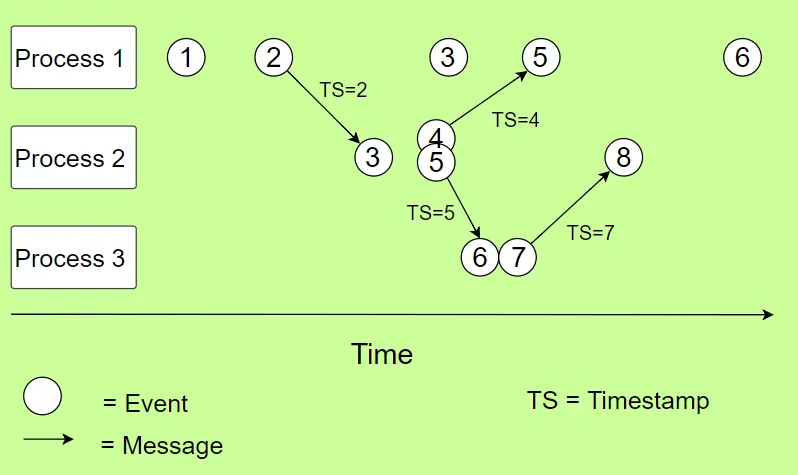

# SIN142 RelogioLógico de Lamport

### O que é o Relógio Lógico de Lamport?

Um relógio lógico Lamport é um contador incrementado mantido em cada processo. Conceitualmente, esse relógio lógico pode ser pensado como um relógio que só tem sentido em relação às mensagens que se movem entre os processos. Quando um processo recebe uma mensagem, ele ressincroniza seu relógio lógico com aquele remetente (causalidade).

O algoritmo de Lamport como Timestamps pode ser resumido em algumas regras:

1. Todos os contadores de processo começam com o valor 0.
2. Um processo incrementa seu contador para cada evento (evento interno, envio de mensagem, recebimento de mensagem) nesse processo.
3. Quando um processo envia uma mensagem, ele inclui seu valor de contador (incrementado) com a mensagem.
4. Ao receber uma mensagem, o contador do destinatário é atualizado para o maior de seu contador atual e o carimbo de data/hora na mensagem recebida e, em seguida, incrementado em um.

### Considerações

Observando essas regras, podemos ver que o algoritmo criará uma sobrecarga mínima, pois o contador consiste em apenas um valor inteiro e as mensagens pegam carona nas mensagens entre processos.

Uma das deficiências de Lamport com Timestamps está enraizada no fato de que eles apenas ordenam parcialmente os eventos (em oposição à ordem total). A ordem parcial indica que nem todos os pares de eventos precisam ser comparáveis. Se dois eventos não puderem ser comparados, chamamos esses eventos de concorrentes. O problema com Lamport Timestamps é que eles não podem dizer se os eventos são simultâneos ou não. Este problema é resolvido por Vector Clocks.

### Exemplo Prático

Se as descrições acima parecerem um pouco confusas para você, dê uma olhada no exemplo a seguir. Todos os processos iniciam com seu contador interno (relógio) em zero. Para cada evento, representado por um círculo, o contador é incrementado em um. Quando um processo recebe uma mensagem, ele configura seu contador para o maior entre seu contador interno e o timestamp incluído na mensagem abaixo.

Por exemplo, considere o primeiro evento do processo 2, onde ele recebe uma mensagem do processo 1. O contador local do processo 2 está neste momento em 0, mas incrementado para 1 porque receber uma mensagem é um evento. O timestamp incluído na mensagem será 2: a hora local do processo 1 incrementada em 1 (1+1). O processo 1 irá ao mesmo tempo em que enviar a mensagem também incrementar seu próprio clock em 1.

Para definir o novo horário no processo 2, pegue o máximo entre o timestamp recebido e seu próprio horário local (max(2,1)) e incremente-o com 1. Isso resultará em um novo timestamp com valor 3. Isso faz sentido, já que a mensagem nunca pode ser recebida antes ou ao mesmo tempo em que foi enviada.

#### Implementação

Nossa implementação (código disponível no Github) executará três processos separados que podem se comunicar entre si por meio de mensagens. Cada processo possui seu próprio contador interno que será atualizado a cada evento. Nosso script imprimirá uma linha para cada evento juntamente com o contador interno atualizado e o tempo na máquina executando os processos.

Antes de começarmos, precisamos importar algumas funções de módulos padrão: Process e Pipe de multiprocessamento para executar vários processos Python com um script, getpid de os para obter o ID do processo de cada processo e datetime de datetime para obter a hora atual.

### Pergunta-se

1. Como o relógio de Lamport é representado nessa implementação?
2. Como os relógios são atualizados em cada evento?
3. Como os relógios são comparados para determinar a ordem dos eventos?
4. O que acontece quando uma mensagem é enviada de um processo para outro? Como os relógios são atualizados nesse caso?
5. E quando uma mensagem é recebida por um processo? Como os relógios são atualizados?
6. Existe alguma lógica para lidar com eventos concorrentes? Se sim, como é implementada?
7. Como você garante que os relógios estejam consistentes entre os processos?
8. Qual é o resultado esperado da execução desse código? Os eventos e as mensagens estão sendo impressos na ordem correta?

Entregar o PDF no Moodle.
